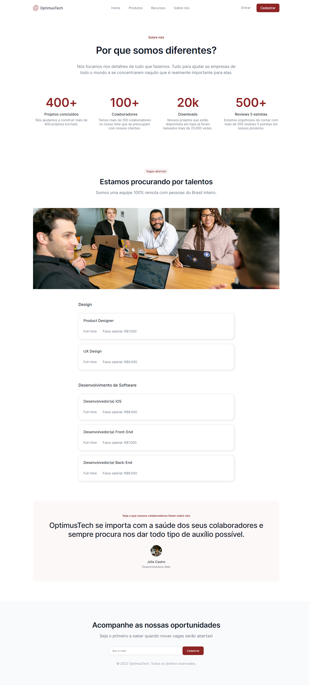

# OptimusTech (7 Days of Code)

O OptimusTech foi desenvolvido durante o desafio 7 Days of Code criado pela [Girl Coding](https://github.com/giovannamoeller/).

O design do projeto foi disponibilizado através do Figma, e tive como desafio reproduzir o layout em código,
utilizando HTML e CSS.

---

[Clique aqui para acessar](https://joaoliveirapb.github.io/7daysOfCode-optimusTech/)

## 🛠️ Tecnologias

- HTML
- CSS

## 💙 Contato

joaoliveira.batista1@gmail.com
